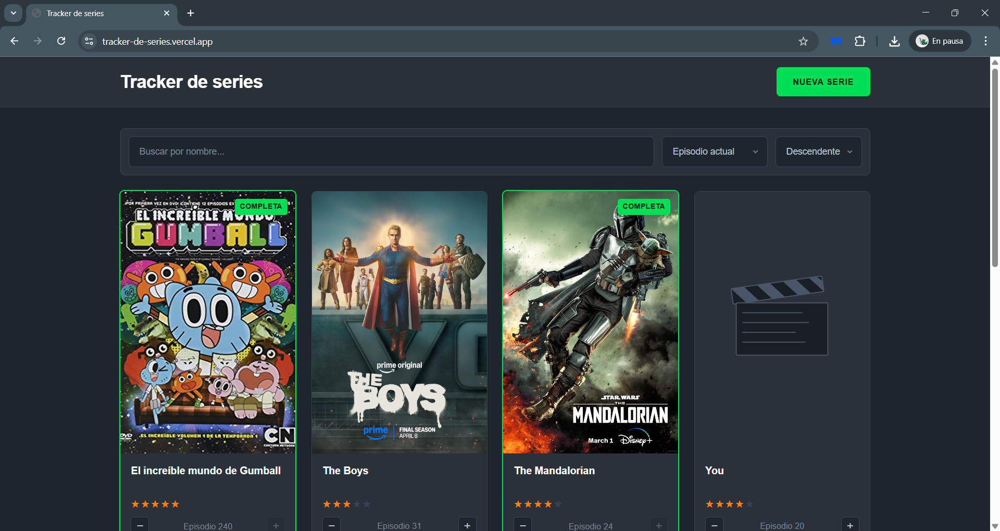

# Tracker de series — Frontend

Sistemas y tecnologías web - S40
> Marco Carbajal (23025)

Cliente web para el tracker de series. Consume la API REST del backend con `fetch()` y se construye con HTML, CSS y JavaScript vanilla, sin frameworks ni librerías externas.

Backend del proyecto: https://github.com/marcocarbajalb/proyecto1_web_backend

App en producción: https://tracker-de-series.vercel.app

## Stack

- HTML5 + CSS3
- JavaScript vanilla (sin frameworks, sin jQuery, sin librerías)
- `fetch()` nativo para la comunicación con la API

## Correr localmente

El backend debe estar corriendo en `http://localhost:8080` antes de abrir el cliente.

```bash
git clone https://github.com/marcocarbajalb/proyecto1_web_frontend
cd proyecto1_web_frontend
python3 -m http.server 5500
```

Después abrir `http://localhost:5500` en el navegador. El cliente detecta automáticamente si está corriendo en local o en producción y apunta al backend correspondiente.

## Estructura del proyecto

```
proyecto1_web_frontend/
├── index.html
├── css/
│   ├── reset.css
│   └── styles.css
├── js/
│   ├── config.js  # URL del backend
│   ├── api.js     # wrappers de fetch
│   ├── ui.js      # renderizado al DOM
│   └── app.js     # orquestación y eventos
└── assets/
    └── placeholder.svg
```

Cada archivo JS tiene una responsabilidad clara: `api.js` solo hace peticiones y no toca el DOM, `ui.js` solo renderiza y no hace fetch, `app.js` conecta ambos y maneja los eventos de la interfaz.

## Funcionalidades

- Listado de series con grid responsive
- Crear, editar y eliminar series desde modales
- Subida de imagen de portada (máximo 1 MB, jpg/png/webp)
- Sistema de rating con estrellas clickeables
- Incremento y decremento rápido del episodio actual
- Búsqueda por nombre en vivo con debounce
- Ordenamiento por distintos criterios (nombre, episodios, más reciente)
- Paginación con controles de navegación
- Indicador visual para series completadas

## Challenges implementados

Los challenges objetivos están implementados en el backend. El frontend consume e integra todas sus funcionalidades:

- Búsqueda por nombre (`?q=`)
- Ordenamiento (`?sort=` y `?order=`)
- Paginación con metadata (`?page=` y `?limit=`)
- Sistema de ratings con tabla y endpoints propios
- Subida de imágenes con validación

## Reflexión

Trabajar con HTML, CSS y JavaScript puros después de conocer los frameworks fue una experiencia bastante interesante. Me forzó a entender qué hacen realmente por debajo las herramientas con las que usualmente se desarrollan este tipo de proyectos. Por ejemplo, tener que hacer nuestro propio event delegation en lugar de usar listeners automáticos, o armar el renderizado de cards con template strings, son cosas que normalmente están escondidas pero que aquí se tienen que hacer "a mano".

Lo que más me costó entender al principio fue CORS. No es algo obvio hasta que el navegador te bloquea la primera petición y tienes que investigar qué está pasando. Me pareció importante entender que no es un bug ni un error del servidor, sino una política de seguridad del navegador, y que la solución implica que el backend diga explícitamente qué orígenes acepta. Después lo ajusté para que en desarrollo permita cualquier origen, y en producción solo acepte mi dominio de Vercel.

Otra cosa que me resultó útil fue separar el JavaScript en tres archivos con responsabilidades claras: `api.js` solo habla con el backend, `ui.js` solo renderiza al DOM, y `app.js` conecta los dos y maneja los eventos. Al principio parecía demasiado para un proyecto de este tamaño, pero cuando necesité agregar features nuevas (búsqueda, ordenamiento, rating), sabía exactamente a qué archivo ir y el código se podía entender mucho más fácil. 

Para el diseño me inspiré en Letterboxd, una plataforma que usamos bastante con mi novia para hacer reseñas de las películas que miramos. Me gusta el contraste de su paleta oscura con el acento verde y el naranja de los ratings, y las cards estilo poster. Tratar de replicar esa estética me obligó a prestar atención a detalles que normalmente ignoro, como las proporciones de las imágenes, el espaciado entre elementos, y el uso de sombras sutiles para dar profundidad en modo oscuro.

Por último, el deploy en Vercel fue muchísimo más simple de lo que esperaba. Conectar el repositorio de GitHub y que cada push redeploye automáticamente es una comodidad que no había experimentado antes. Encima es completamente gratuito; me parece mucho mejor que la plataforma que utilicé para el backend (Fly.io).

## Screenshots

Vista principal de la aplicación:



Paginación y controles de navegación:

